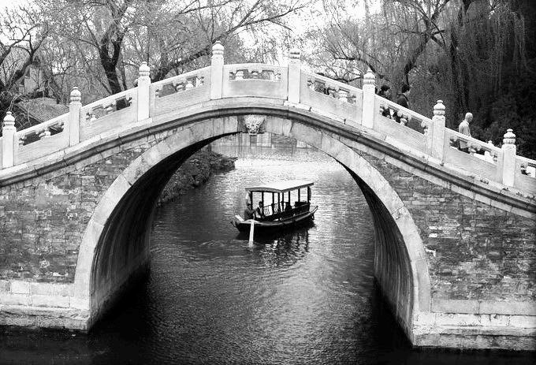
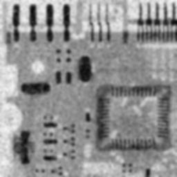
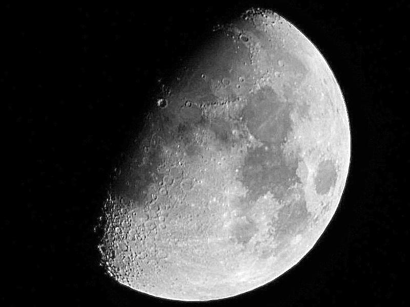

# 第二次作业报告

#### 黄志鹏 PB16150288

## 实验题目：图像直方图均衡化& 空域滤波

## 实验目的

- 理解图像直方图均值化，均值滤波，中值滤波，图像锐化的原理
- 对以上方法进行代码的实现
- 进一步熟悉matlab语言在图像处理中的应用
  
## 实验原理

### 1. 直方图均衡化
考虑一个离散的灰度图像 {x}，让 ni 表示灰度 i 出现的次数，这样图像中灰度为 i 的像素的出现概率是
$$
{\displaystyle \ p_{x}(i)=p(x=i)={\frac {n_{i}}{n}},\quad 0\leq i<L} \ p_x(i) = p(x=i) = \frac{n_i}{n},\quad 0 \le i < L 
$$
L 是图像中所有的灰度数（通常为256）， ${\displaystyle n}$ 是图像中所有的像素数， ${\displaystyle p_{x}(i)}$ 实际上是像素值为 i 的图像的直方图，归一化到 [0,1]。

把对应于 px 的累积分布函数，定义为：
$$
{\displaystyle \ cdf_{x}(i)=\sum _{j=0}^{i}p_{x}(j)} \ cdf_x(i) = \sum_{j=0}^i p_x(j),
$$
是图像的累计归一化直方图。

我们创建一个形式为 y = T(x) 的变换，对于原始图像中的每个值它就产生一个 ${\displaystyle y}$，这样 ${\displaystyle y}$ 的累计概率函数就可以在所有值范围内进行线性化，转换公式定义为：
$$
{\displaystyle \ cdf_{y}(i)=iK} \ cdf_y(i) = iK
$$
对于常数 K。CDF的性质允许我们做这样的变换（参见逆分布函数）；定义为
$$
{\displaystyle \ cdf_{y}(y^{\prime })=cdf_{y}(T(k))=cdf_{x}(k)} \ cdf_y(y^\prime) = cdf_y(T(k)) = cdf_x(k)
$$
其中 k 属于区间 [0,L)。注意 T 将不同的等级映射到 ${\displaystyle {0..1}}$域，为了将这些值映射回它们最初的域，需要在结果上应用下面的简单变换：
$$
{\displaystyle \ y^{\prime }=y\cdot (\max\{x\}-\min\{x\})+\min\{x\}} \ y^\prime = y \cdot(\max\{x\} - \min\{x\}) + \min\{x\}
$$
上面描述了灰度图像上使用直方图均衡化的方法，但是通过将这种方法分别用于图像RGB颜色值的红色、绿色和蓝色分量，从而也可以对彩色图像进行处理。

### 2. 均值滤波与图像平滑

这个算法将图像每个像素点，与它周围的9个像素点加权平均之后赋值给原来的像素点。以做到图像平滑的作用
$$
{\displaystyle newPix _{x, y} = \frac {\sum _{i=-1}^{1} \sum _{j=-1}^{1} Pix _{(x+i), (y+j)}}{9}}
$$
采用的padding的方式可以是：
- 不做边界处理
- 补0
- 补充最近的像素点

### 3. 中值滤波与图像平滑

这个算法将每个像素点的周围9个像素点， 去其中的中值， 这样可以很好地保护图像边界不被虚化
$$
newPix _{x, y} = Median _{i, j = -1, -1}^{1, 1} Pix _{x+i, y+j}
$$

### 4. 利用图像锐化进行图像增强

使用拉普拉斯算子对图像进行锐化

$$
\Delta f = \frac{\partial^2f}{\partial x^2} + \frac{\partial^2 f}{\partial y^2}
$$

得到的梯度图像与原图相加之后， 可以起到图像增强的作用

$$
g(x, y) = f(x, y) + \Delta f(x, y)
$$

## 实验内容

### 1. 直方图均衡化

```matlab
function [img_2] = myHisteq(img_1, n)
%% 这个函数里面使用的都是 uint8型的数据
size_1 = size(img_1);
h = size_1(1);
w = size_1(2);
img_2 = zeros(h, w, 'uint8');

% 请在下面继续完成直方图均衡化功能代码
%% 统计图像的直方图
stat = zeros(256, 1);
for i = 1: h
    for j = 1: w
        value = img_1(i, j);
        stat(value + 1, 1) = stat(value + 1, 1) + 1;
    end
end
assert(sum(stat(:)) == h * w);
%% 使用统计得来的直方图， 产生统计直方图均衡图像
for i = 1: h
    for j = 1: w
        % 调用的函数在下面有定义
        img_2(i, j) = myDecimalIntegral(stat, img_1(i, j), h * w, n);
    end
end
%% img_2 = im2uint8(img_2); 问题就出现在这里， double 转 int 会自动调用 im2uint8
end


function result = myDecimalIntegral(stat, lastValue, sumOfNumber, n)
%% 计算lastValue 之前累积的灰度点个数
sum = 0;
for x = 1: lastValue + 1
    sum = sum + stat(x, 1);
end
%% 利用之前积分的灰度点个数 来计算新的灰度值
if n == 2
    % 这里单独写, 是为了是2级灰度图像 的分辨更加明显, 0 和255 而不是0 和127
    result = round(sum / sumOfNumber) * 255;
else
    result = floor(sum / sumOfNumber * n) * (256 / n);
end
result = max(0, min(255, result));
end
```

### 2. 均值滤波

```matlab
function [img_2] = myAverage(img_1)
img_1 = im2double(img_1);
%% 调用均值滤波4次
for i = 1: 4
    img_1 = getOnce(img_1);
end
img_2 = img_1;
img_2 = im2uint8(img_2);
end

%% 这个函数实现一次的滤波
function img_2 = getOnce(img_1)
size_1 = size(img_1);
h = size_1(1);
w = size_1(2);
img_2 = zeros(h, w);
weight = ones(3, 3);
data = zeros(3, 3);
% 请在下面继续完成均值滤波功能代码
for i = 1: h
    for j = 1: w
        %% 这里获得周围的9个像素点的位置， 这里使用min，max来防止边缘处的越界错误， 相当于是近邻值得padding
        for a = 1: 3
            for b = 1: 3
                data(a, b) = img_1(min(max(i - 2 + a, 1), h), min(max(j - 2 + b, 1), w));
            end
        end
        %% 这里系数和9个周围像素点取加权平均
        img_2(i, j) = sum(sum(weight.* data)) / 9; 
    end
end
end
```

### 3. 中值滤波

```matlab
function [img_2] = myMedian(img_1)
img_1 = im2double(img_1);
%% 调用中值滤波4次
for i = 1: 4
    img_1 = getOnce(img_1);
end
img_2 = img_1;
img_2 = im2uint8(img_2);        
end

%% 下面的函数是一次的均值滤波
function img_2 = getOnce(img_1)
size_1 = size(img_1);
h = size_1(1);
w = size_1(2);
img_2 = zeros(h, w);
data = zeros(3, 3);
for i = 1: h
    for j = 1: w
        %% 这里获得周围的9个像素点的位置， 这里使用min，max来防止边缘处的越界错误，相当于是近邻值的padding
        for a = 1:3
            for b = 1:3
                data(a, b) = img_1(min(max(i - 2 + a, 1), h), min(max(j - 2 + b, 1), w));
            end
        end
        %% 取9 个像素点的中值
        img_2(i, j) = median(data(:));
    end
end
end
```

### 4. 锐化函数增强图像
```matlab
function [img_2] = mySharpen(img_1)
img_1 = im2double(img_1);
size_1 = size(img_1);
h = size_1(1);
w = size_1(2);
img_2 = zeros(h, w);
% 这里讲 拉普拉斯和 图像增强相结合
weight = [-1 -1 -1; -1 9 -1; -1 -1 -1]
data = zeros(3, 3);

for i = 1: h
    for j = 1: w
        %% 这里获得周围的9个像素点的位置， 这里使用min，max来防止边缘处的越界错误， 相当于是近邻值得padding
        for a = 1: 3
            for b = 1: 3
                data(a, b) = img_1(min(max(i - 2 + a, 1), h), min(max(j - 2 + b, 1), w));
            end
        end
        %% 这里系数和9个周围像素点依次相乘 然后相加 取绝对值
        img_2(i, j) = abs(sum(sum(weight.* data)));
    end
end
end
```


## 实验结果分析

### 1. 直方图均衡化

- n = 2

- n = 64

- n = 256


### 2. 均值滤波



### 3. 均值滤波


### 4. 锐化图像增强



## 实验总结

### 1. 实验过程中遇到的问题
a. 在直方图均衡化的实验中， 由于像素点直方图的统计需要使用 uint8 型的类型， 但是老师的框架中， zeros函数默认使用double型， 导致img_2 最后虽然是 0到255 的整数， 但是实际上的类型是double。 故在使用imshow和imwrite的时候，自动检测为0 - 1 的double 图像， 导致图像全白。 这个时候就算是在输出口调用im2uint8（）函数也无济于事， 因为这个函数也是默认将输入的img_2 当做是0 - 1的double， 最后的图像还是全白。

b. 在滤波和锐化过程中， 需要使用到权值矩阵的卷积， 这个时候图像边界会出现问题，此时可以采用的方法是

- padding 0 
  ```matlab
  img_1 = padarray(img_1, [1, 1], 0)
  ```
- 近邻值padding
  我没有找到matlab 具体的实现 于是使用了max 和min 函数手动实现了
  ```matlab
  for a = 1: 3
    for b = 1: 3
    data(a, b) = img_1(min(max(i - 2 + a, 1), h), min(max(j - 2 + b, 1), w));
    end
  end 
  ```
稍加分析就会知道 padding 近邻值会比 padding 0 效果来得好

### 2. 出了原理和实现之外学到的东西

- 在书写数值计算代码是一定要注意数据类型
- 变量命名要有具体含义， 不要和循环变量撞上了， 如权重w 和 图像宽w， 故权重命名为weight。
