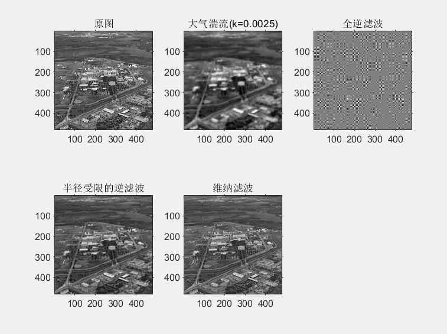
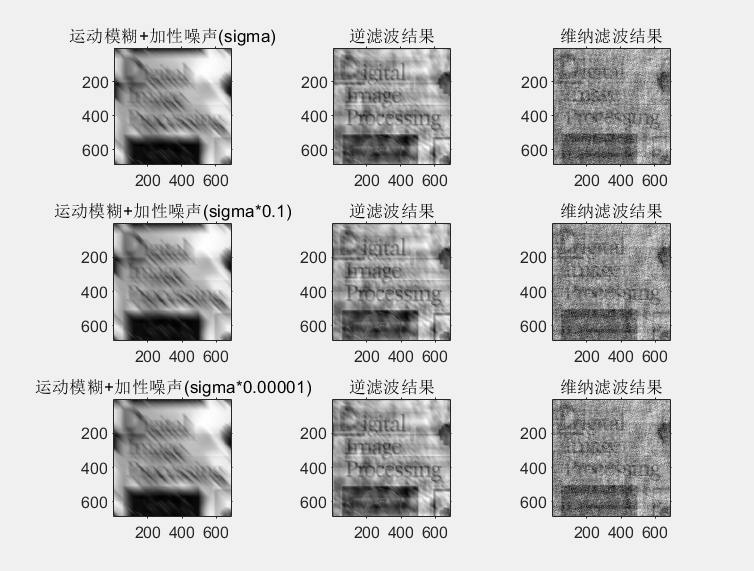

# 第三次作业报告

#### 黄志鹏 PB16150288

## 实验题目： 逆滤波与维纳滤波比较

## 实验目的

- 理解逆滤波和维纳滤波的原理， 理解图像的退化和复原过程
- 对以上方法进行代码的实现
  
## 实验原理

### 1. 图像退化模型

如下图，退化程序可以被模式化成一个退化函数（Degradation function），连同加成性噪声（Noise）η(x,y)共同作用在一输入影像f(x,y)上，产生一退化影像g(x,y)：

$$
{\displaystyle g(x,y)=H[f(x,y)]+\eta (x,y)} {\displaystyle g(x,y)=H[f(x,y)]+\eta (x,y)}
$$

因此就可以利用对退化函数H以及噪声η(x,y)的了解，来获得一个原始影像的估测f ̂(x,y)。如果H为一个线性空间不变量（linear spatially invariant）的程序，则可以证明退化影像在空间域（spatial domain）为

$$
{\displaystyle g(x,y)=h(x,y)*f(x,y)+\eta (x,y)} {\displaystyle g(x,y)=h(x,y)*f(x,y)+\eta (x,y)}
$$

其中h(x,y)是退化函数的空间表示，*代表回旋积（convolution），因此我们可以将上式中的模型写成等效的频率域（frequency domain）表示式：

$$
{\displaystyle G(u,v)=H(u,v)F(u,v)+N(u,v)} {\displaystyle G(u,v)=H(u,v)F(u,v)+N(u,v)}
$$

其中大写字母的各项是对于回旋积方程中各项的傅里叶转换。而影像的撤销可以大致分为两个情形进行分析，第一为假定H是一个恒等运算符，而我们只处理由噪声所造成的退化。而第二个情形是查看在H和η都存在的情况进行影像的撤销。

### 2. 逆滤波

我们撤销一张退化影像所能采取的最简单方法是形成形式如下的一个估测： ${\displaystyle {\hat {F}}(u,v)={\frac {G(u,v)}{H(u,v)}}} {\displaystyle {\hat {F}}(u,v)={\frac {G(u,v)}{H(u,v)}}}$ 然后借由 ${\displaystyle {\hat {F}}(u,v)} {\displaystyle {\hat {F}}(u,v)}$的反傅里叶转换获得域个影像的相对应估测，这个方法被称为反滤波（inverse filtering），由影像撤销模型，我们可以将我们的估测表示成： 

${\displaystyle {\hat {F}}(u,v)={\frac {G(u,v)}{H(u,v)}}} {\displaystyle {\hat {F}}(u,v)={\frac {G(u,v)}{H(u,v)}}}$

由此式可知，即使我们确切的知道H(u,v)，我们仍无法撤销F(u,v)，因为噪声分量是一个它的傅里叶转换N(u,v)未知的随机函数。此外通常实际上有一个问题是函数H(u,v)有许多零点。即使N(u,v)这一项可忽视，将他除以H(u,v)几乎为零的值会主宰撤销的估测。

试图反滤波的典型方法是形成比值 ${\displaystyle {\hat {F}}(u,v)={\frac {G(u,v)}{H(u,v)}}} {\displaystyle {\hat {F}}(u,v)={\frac {G(u,v)}{H(u,v)}}}$，然后限制获得这个反滤波的频率范围到“接近”原点的频率。此想法是H(u,v)中零点比较不可能再接近原点处发生，因为通常转换的大小在该区域中有其最高值。有许多基调的变形，其中在H是零或靠近零的(u,v)处特别处理。这种方法有时称为虚拟反（pseudoinverse）滤波。

### 3. 维纳滤波

Wiener滤波[永久失效链接]寻求使以下统计误差函数最小化的估测 ${\displaystyle {\hat {f}}}$

$$
{\displaystyle e^{2}=E{(f-{\hat {f}}^{2})}} {\displaystyle e^{2}=E{(f-{\hat {f}}^{2})}}
$$

其中E是期望值运算符而f是未退化的影像。此表示式在频率域中的解为：${\displaystyle {\hat {F}}(u,v)=\left[{\frac {1}{H(u,v)}}{\frac {\left|H(u,v)\right|^{2}}{\left|H(u,v)\right|^{2}+S_{\eta }(u,v)/S_{f}(u,v)}}\right]G(u,v)} {\displaystyle {\hat {F}}(u,v)=\left[{\frac {1}{H(u,v)}}{\frac {\left|H(u,v)\right|^{2}}{\left|H(u,v)\right|^{2}+S_{\eta }(u,v)/S_{f}(u,v)}}\right]G(u,v)}$

其中
$$
{\displaystyle H(u,v)} {\displaystyle H(u,v)}=退化函数
$$
$$
{\displaystyle \left|H(u,v)\right|^{2}=H*(u,v)H(u,v)} {\displaystyle \left|H(u,v)\right|^{2}=H*(u,v)H(u,v)}
$$
$$
{\displaystyle H*(u,v)=H(u,v)} {\displaystyle H*(u,v)=H(u,v)}的共轭复数
$$
$$
{\displaystyle S_{\eta }(u,v)} {\displaystyle S_{\eta }(u,v)}=噪声方功率频谱
$$
$$
{\displaystyle S_{f}(u,v)} {\displaystyle S_{f}(u,v)}=未退化影像的功率频谱
$$

比值 ${\displaystyle S_{\eta }} {\displaystyle S_{\eta }}(u,v)/ {\displaystyle S_{f}} {\displaystyle S_{f}}(u,v)$称为噪声对信号功率比，可以看出对所有u和v的相关值，如果噪声功率频谱为零，则此比值成为零，而Wiener滤波器简化成在反滤波器。

### 4. 运动模糊

假设有一清晰平面图片 ${\displaystyle y(x)}$ ,我们只能观察到其模糊后的图片 ${\displaystyle (y\star psf)(x)}$ , ${\displaystyle psf(x)}$ 为已知的点扩散函数PSF(Point Spread Function), ${\displaystyle \star }$ 表示卷积（折积）（convolution）。 假设此卷积为离散且有噪声，我们观察到的图片可表示成：
$$
{\displaystyle z(x)=(y\star psf)(x)+\epsilon (x),} z(x)=(y\star psf)(x)+\epsilon (x),
{\displaystyle \epsilon (x)} \epsilon (x)为噪声。 
$$
$$
{\displaystyle x} x为分布在整齐的 {\displaystyle n_{1}} n_{1}× {\displaystyle n_{2}} n_{2}格子X中， $$

$${\displaystyle X=\{k_{1},k_{2}:k_{1}=1,2,...,n_{1},k_{2}=1,2,...,n_{2}\}} X=\{k_{1},k_{2}:k_{1}=1,2,...,n_{1},k_{2}=1,2,...,n_{2}\}。
$$

运动模糊
$$
H(u, v)=\frac{T}{\pi(u a+v b)} \sin [\pi(u a+v b)] e^{-j \pi(u a+v b)}
$$

### 5. 高斯噪声

高斯（Gaussian）

$$
{\displaystyle p(z)={\frac {1}{{\sqrt {2\pi }}\sigma }}e^{-(z-\mu )^{2}/2\sigma ^{2}}} {\displaystyle p(z)={\frac {1}{{\sqrt {2\pi }}\sigma }}e^{-(z-\mu )^{2}/2\sigma ^{2}}}
$$

$$
h(m, n)=\left\{\begin{array}{c}{K \exp \left[-\alpha\left(m^{2}+n^{2}\right)\right] \quad \ (m, n) \in C} \\ {0} \  \end{array}\right.
$$

## 实验内容

### 1. my_invert.m

```matlab
function [im_inverse, im_inverse_b] = my_inverse(img, H, D0)

[M,N] = size(img);
%% 下面实现全逆滤波
im_double = mat2gray(img,[0 255]);
im_F = fftshift(fft2(im_double)); 
im_F_inverse = im_F ./ H;
im_inverse_double = real(ifft2(ifftshift(im_F_inverse)));    % 频域 > 空域
im_inverse = im2uint8(mat2gray(im_inverse_double));

%% 下面实现半径首先逆滤波
H_b = max(D0 / 255 * ones(M, N), H);
im_F_inverse_b = im_F./H_b;
im_inverse_b_double = real(ifft2(ifftshift(im_F_inverse_b)));    % 频域 > 空域
im_inverse_b = im2uint8(mat2gray(im_inverse_b_double));
```

### 2. my_wiener.m

```matlab
function im_wiener = my_wiener(img, H, K)
im_double = mat2gray(img,[0 255]);
im_F = fftshift(fft2(im_double)); 
H_square = H .* H;
im_F_wiener = im_F .* (H_square ./ (H_square + K)) ./ H;
im_wiener_double = real(ifft2(ifftshift(im_F_wiener)));    % 频域 > 空域
im_wiener = im2uint8(mat2gray(im_wiener_double));
```

### 3. motionblur.m
```matlab
function [H, im_blured] = motionblur(img, sigma)
[M,N] = size(img);
% 运动模糊退化函数

%% 参数设置
H_moved = zeros(M, N);
H_gaussian = zeros(M, N);
H = zeros(M, N);
a = 0.1;
b = 0.1;
T = 1;
K = 0.01 * sigma;
alpha = 0.0001;
%% 产生退化函数
for u = 1: M
    for v = 1: N
        tmp = pi .* ((u  - M ./ 2) .* a + (v - N ./ 2) .* b);
        % 这里防止零频分量在之后的H（退化函数）中产生无穷大的量
        if abs(tmp) < 0.1
            tmp = 0.1;
        end
        tmp2 = (u - M ./ 2).^2 + (v - N ./ 2).^2;
        % 这里防止零频分量在之后的H（退化函数）中产生无穷大的量
        if abs(tmp2) < 0.1
            tmp2 = 0.1;
        end
        H_moved(u, v) = (T ./ tmp) .* sin(tmp) .* exp(-i .* tmp);
        H_gaussian(u, v) = K .* exp(-alpha .* tmp2);
    end
end

%% 使用退化函数对图像进行模糊化处理 
im_double = mat2gray(img,[0 255]);
im_F = fftshift(fft2(im_double));      % 空域 > 频域 
im_blured_F = im_F .* H_moved .* H_gaussian;    % 退化
im_blured_double = real(ifft2(ifftshift(im_blured_F)));    % 频域 > 空域
im_blured = im2uint8(mat2gray(im_blured_double));
H = H_moved .* H_gaussian;
```

## 实验结果分析

### 1. 大气湍流退化



### 2. 运动模糊+高斯噪声污染



## 实验总结

### 1. 实验过程中遇到的问题和解决方法

在实验的第二题， 即实现motionblur.m 函数， 来对图像进行运动模糊和高斯加噪的处理， 并返回模糊之后的图像和图像的退化函数。

由老师的主函数框架中的代码
```matlab
[H, im1_f] = motionblur(im, sigma);        % 噪声方差=0.01
[~, im2_f] = motionblur(im, sigma*0.1);        
[~, im3_f] = motionblur(im, sigma*0.00001);        % H：退化模型
```

可以知道, 这个motionblur.m的意图应该是先产生固定样式(不同参数)的H(图像退化函数), 然后作用于图像.

而不是直接调用系统的模糊函数api, 然后使用:$H(u, v) = \frac {f(u, v)}{g(u, v)}$ 来对图像退化函数进行模拟

故需要自己在频域使用公式：

运动模糊
$$
H(u, v)=\frac{T}{\pi(u a+v b)} \sin [\pi(u a+v b)] e^{-j \pi(u a+v b)}
$$

高斯模糊
$$
h(m, n)=\left\{\begin{array}{c}{K \exp \left[-\alpha\left(m^{2}+n^{2}\right)\right] \quad \ (m, n) \in C} \\ {0} \  \end{array}\right.
$$

但是在使用这两个公式的时候， 出现了图像norm之前有无穷大的情况， 是的图像经过正规化之后出现全白。 检查之后发现是公式使用过程中会出现零频分量的问题， 这是应该用小量取极限， 如下：
```matlab
        if abs(tmp) < 0.1
            tmp = 0.1;
        end
```
这样零频分量的问题就解决了.

### 2. 出了原理和实现之外学到的东西

数据处理中可以使用矩阵grid同时处理, 如
```matlab
[u,v]=meshgrid(1:M,1:N);    % 生成二维坐标系
H=exp(-k* ( (u-M/2).^2+(v-N/2).^2).^(5/6) );
```
这种方式既可以提高运算速度, 代码又比较简洁
